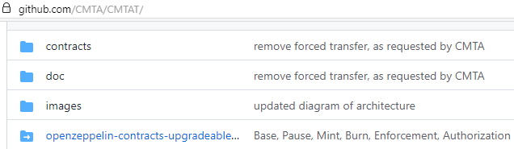
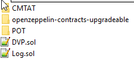

# DvP for CMTA

The commands below must be executed in the `src/solidity` folder.

### Setup

- `npm install`

uses package.json

### Compilation and Test

- `npx hardhat compile`
- `npx hardhat test`

uses hardhat.config.ts

### Deployment

- `npx hardhat deploy_all_contracts`

uses hardhat.config.ts


## CMTA Token Contract

### Cloning and integrating

The CMTA Token (CMTAT) sources are located at https://github.com/CMTA/CMTAT/.

`git clone https://github.com/CMTA/CMTAT/` clones them, with an empty `openzeppelin-contracts-upgradeable` folder.



The easy-to-overlook arrow next to the openzeppelin... folder means that a fixed set of these files is used:
https://github.com/OpenZeppelin/openzeppelin-contracts-upgradeable/tree/aeb86bf4f438e0fedb5eecc3dd334fd6544ab1f6

You should download [this archive](https://github.com/OpenZeppelin/openzeppelin-contracts-upgradeable/archive/aeb86bf4f438e0fedb5eecc3dd334fd6544ab1f6.zip) and unpack it next to the CMTAT folder. To simplify local changes like logging and test functions, these 159 contracts were (temporarily) pushed to our git.

The CMTA smart contracts do not import the OpenZeppelin ones from the npm registry (`import "@openzeppelin/contracts-upgradeable/...`, but the local files (`import "../../openzeppelin-contracts-upgradeable/contracts/...`)).

:warning: As to Sébastien Krafft:

> The reason is to force openzeppelin version and not be dependent of npm for the audit of the smart contracts and to avoid problems with minor version upgrades. Mainly for security reasons, you should not use another version than the one that is in the Github


So the folders must have this structure in src/solidity/contracts:




You **would** install install the OZ Contracts like this:

```
npm install @openzeppelin/contracts
npm install @openzeppelin/contracts-upgradeable
```


### Local adaptions

`CMTAC.sol` has many base classes. `AccessControlUpgradeable.sol`  and `CMTAT.sol`itself implement complex _role-based access control mechanisms_ (see comment). This will not be operated by us, which is why for development, this was turned off:

```solidity
function mint(address to, uint256 amount) public
//onlyRole(MINTER_ROLE)
```


### approve vs. increaseAllowance

`ERC20Upgradeable.sol ` implements the functions `increaseAllowance` and `decreaseAllowance` with this comment:

```solidity
  * @dev Atomically increases [decreases] the allowance granted to `spender` by the caller.
  *
  * This is an alternative to {approve} that can be used as a mitigation for
  * problems described in {IERC20-approve}.
```

Why the original `approve` function cannot be called from out tests is yet to be found out.


## Intellectual property

The code is copyright (c) Capital Market and Technology Association,
2022, and is released under [Mozilla Public License
2.0](./LICENSE.md).

